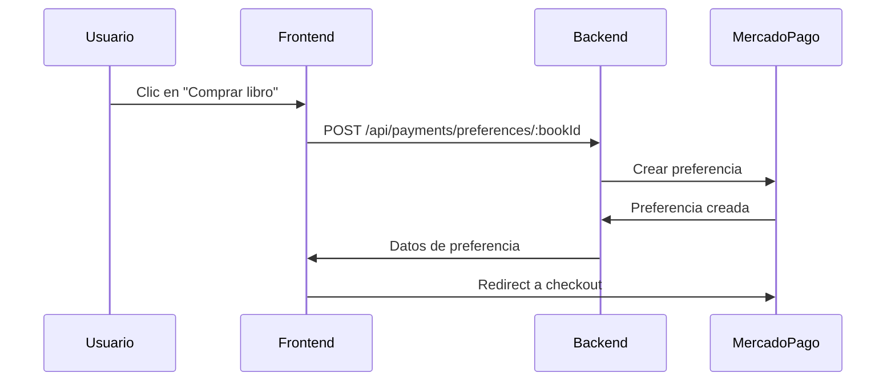
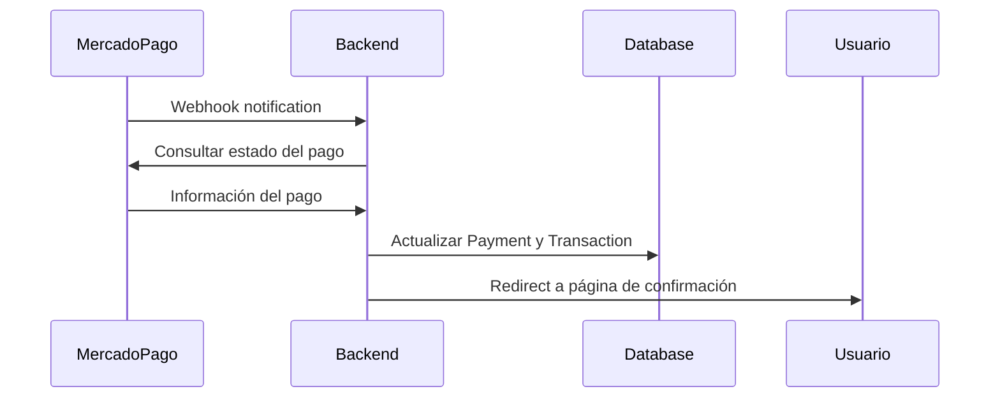

# 💳 Integración con MercadoPago - LibroConecta

## 📋 Resumen

Se ha implementado una integración completa con [MercadoPago](https://www.mercadopago.cl/developers/es/reference) para gestionar pagos de ventas de libros en LibroConecta.

### ✅ Funcionalidades Implementadas

- ✅ Creación de preferencias de pago
- ✅ Procesamiento de pagos vía MercadoPago 
- ✅ Webhook para notificaciones automáticas
- ✅ Páginas de confirmación (éxito, error, pendiente)
- ✅ Historial de transacciones
- ✅ Gestión completa del ciclo de vida del pago
- ✅ Integración con la base de datos
- ✅ Interfaz de usuario completa

## 🏗️ Arquitectura

### Backend (`/backend/`)

#### Modelos de Base de Datos
- **`Payment.js`** - Gestiona información de pagos con MercadoPago
- **`Transaction.js`** - Maneja transacciones completas (ventas, intercambios, regalos)

#### Controlador
- **`Payment.controller.js`** - Lógica completa de pagos:
  - `createPaymentPreference()` - Crear preferencia de pago
  - `handlePaymentWebhook()` - Procesar notificaciones
  - `getPaymentStatus()` - Consultar estado de pago
  - `getUserPayments()` - Historial de pagos

#### Rutas API
- **`Payment.routes.js`**:
  - `POST /api/payments/preferences/:publishedBookId` - Crear preferencia
  - `POST /api/payments/webhook` - Webhook de MercadoPago
  - `GET /api/payments/:paymentId/status` - Estado del pago
  - `GET /api/payments/user` - Historial del usuario

### Frontend (`/frontend/`)

#### Componentes
- **`PaymentButton.jsx`** - Botón de pago integrado
- **`BookCard.jsx`** - Card con botón de compra (actualizado)
- **`BookDetails.jsx`** - Página de detalles con pago (actualizado)

#### Páginas de Pago
- **`PaymentSuccess.jsx`** - Confirmación de pago exitoso
- **`PaymentFailure.jsx`** - Manejo de pagos fallidos
- **`PaymentPending.jsx`** - Pagos pendientes con auto-refresh

#### API Client
- **`payments.js`** - Cliente API para comunicación con backend

## ⚙️ Configuración

### 1. Variables de Entorno

#### Backend (`.env`)
```env
# MercadoPago Credentials
MP_ACCESS_TOKEN=APP_USR-your_access_token_here
MP_PUBLIC_KEY=APP_USR-your_public_key_here  
MP_CLIENT_ID=your_client_id_here
MP_CLIENT_SECRET=your_client_secret_here
MP_WEBHOOK_SECRET=your_webhook_secret_here

# Application URLs
FRONTEND_URL=http://localhost:5173
BACKEND_URL=http://localhost:3000
```

#### Frontend (`.env.local`)
```env
VITE_MP_PUBLIC_KEY=APP_USR-your_public_key_here
VITE_API_URL=http://localhost:3000/api
```

### 2. Base de Datos

Ejecutar migraciones para crear las nuevas tablas:

```sql
-- Crear tablas Payment y Transaction
-- Ver modelos en backend/src/db/models/
```

### 3. Obtener Credenciales de MercadoPago

1. Crear cuenta en [MercadoPago Developers](https://www.mercadopago.cl/developers/)
2. Crear una aplicación
3. Obtener credenciales de test y producción
4. Configurar URLs de notificación

## 🔄 Flujo de Pago

### 1. Inicio de Pago


### 2. Procesamiento de Pago


## 🎯 Casos de Uso

### Compra Exitosa
1. Usuario hace clic en "Comprar libro"
2. Se crea preferencia de pago en MercadoPago
3. Usuario es redirigido al checkout
4. Usuario completa el pago
5. Webhook actualiza el estado en la BD
6. Usuario ve página de confirmación
7. Se crea la transacción automáticamente

### Pago Fallido
1. Usuario inicia pago pero falla
2. MercadoPago notifica el fallo vía webhook
3. Usuario es redirigido a página de error
4. Se muestran posibles causas y soluciones

### Pago Pendiente
1. Pago requiere validación adicional
2. Usuario ve página de "pendiente"
3. Página se auto-actualiza cada 10 segundos
4. Cuando se confirma, redirige a página de éxito

## 🛠️ Características Técnicas

### Seguridad
- ✅ Validación de webhooks
- ✅ Autenticación requerida para crear pagos
- ✅ Validación de propiedad de libros
- ✅ Sanitización de datos

### Performance
- ✅ Paginación en historial de pagos
- ✅ Carga lazy de componentes
- ✅ Optimización de imágenes en cards

### UX/UI
- ✅ Estados de carga visibles
- ✅ Manejo de errores amigable
- ✅ Feedback inmediato al usuario
- ✅ Responsive design
- ✅ Animaciones suaves con Framer Motion

### Monitoreo
- ✅ Logging detallado de transacciones
- ✅ Tracking de errores
- ✅ Métricas de conversión

## 🧪 Testing

### Credentials de Testing (Sandbox)
MercadoPago proporciona credenciales de prueba para testing.

### Tarjetas de Prueba
```
VISA: 4509 9535 6623 3704
CVV: 123
Fecha: 11/25
```

### Usuarios de Prueba
Crear usuarios de prueba usando la [API de MercadoPago](https://www.mercadopago.cl/developers/es/reference/test_user/_users_test/post)

## 📊 Monitoreo y Analytics

### Métricas Importantes
- Tasa de conversión de pagos
- Tiempo promedio de checkout
- Métodos de pago más usados
- Pagos fallidos por causa

### Dashboards
- Estado de transacciones en tiempo real
- Reportes de ventas por período
- Análisis de comportamiento de compra

## 🚀 Deployment

### Variables de Producción
- Usar credenciales reales de MercadoPago
- Configurar URLs de producción
- Habilitar HTTPS para webhooks
- Configurar certificados SSL

### Webhook Configuration
URL del webhook debe ser accesible públicamente:
```
https://tu-dominio.com/api/payments/webhook
```

## 🔧 Troubleshooting

### Problemas Comunes

#### Webhook No Llega
- Verificar URL pública del webhook
- Revisar logs del servidor
- Confirmar configuración en MercadoPago

#### Pagos No Se Procesan
- Verificar credenciales
- Revisar logs de errores
- Confirmar estado de cuenta MercadoPago

#### Frontend No Redirige
- Verificar Public Key
- Revisar URLs de redirect
- Confirmar conexión con backend

## 📚 Referencias

- [Documentación MercadoPago](https://www.mercadopago.cl/developers/es/reference)
- [SDK MercadoPago Node.js](https://www.mercadopago.cl/developers/es/docs/sdks-library/server-side/nodejs-installation)
- [SDK MercadoPago JavaScript](https://www.mercadopago.cl/developers/es/docs/sdks-library/client-side/sdk-js-installation)
- [Webhooks MercadoPago](https://www.mercadopago.cl/developers/es/guides/additional-content/notifications/webhooks)

## ✅ Estado de Implementación

- [x] **Backend completo** - Modelos, controladores, rutas
- [x] **Frontend completo** - Componentes, páginas, API client  
- [x] **Integración funcional** - Flujo completo de pago
- [x] **Manejo de errores** - Páginas de error y validaciones
- [x] **UX optimizada** - Interfaces amigables y responsive
- [x] **Documentación** - Guías completas de implementación

¡La integración con MercadoPago está lista para usar! 🎉 